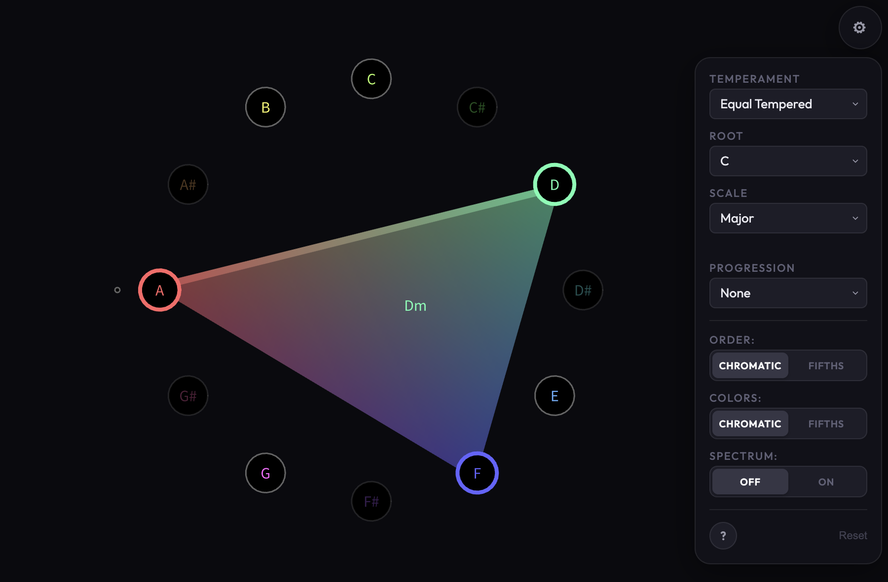

# Interval

An interactive music theory visualization tool built with [p5.js](https://p5js.org/). Explore notes, scales, and chords across different tuning systems.



## Controls

- **1 to =**: Play all 12 chromatic notes.
- **Q to ]**: Play notes in the current scale.
- **Mouse**: Click notes on the wheel.
- **Settings**: Use the panel on the right to change tuning (temperament), scales, and modes.

## Running Locally

Requires a local web server (to handle audio files):
```bash
python -m http.server
# or
npx serve
```

## Credits & License

Interval is based on MusicWheel, a similar application developed for the Java-based Processing.org framework. This p5.js port with additional features was developed with the help of LLM coding assistants.

This project is licensed under [CC BY-NC 4.0](https://creativecommons.org/licenses/by-nc/4.0/). See [LICENSE.md](LICENSE.md) for details.
